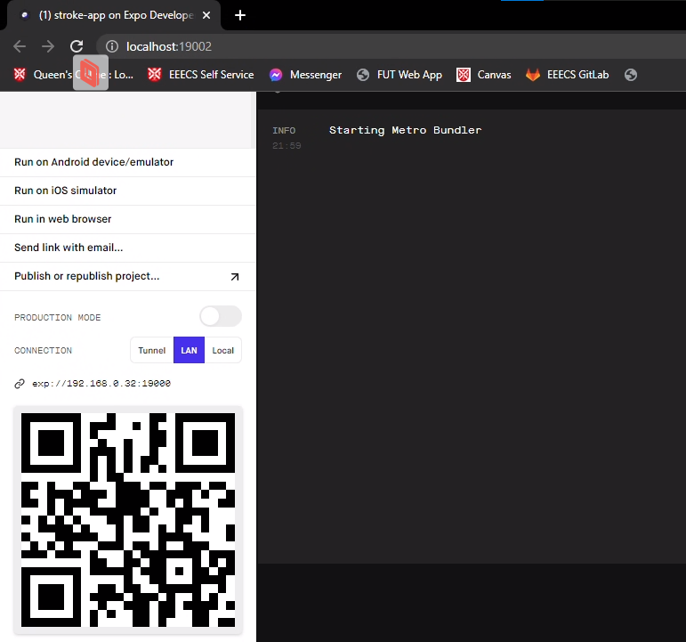
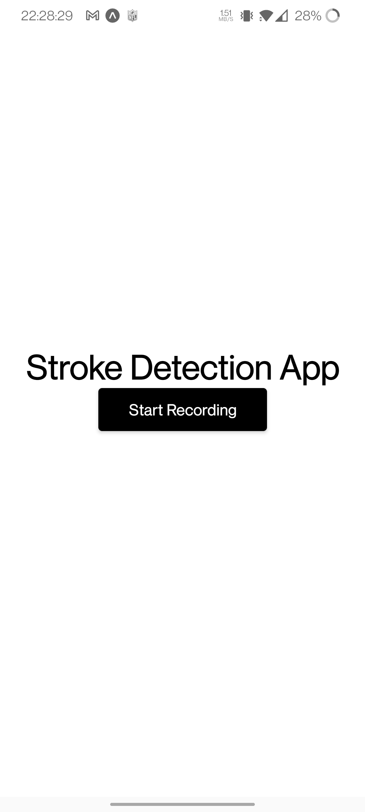

# Front-End Application

## Contents

This directory contains:
- The `App.js` file with the front-end JavaScript to run the application
- The `App.test.js` file that has the unit tests inside it.

## Running the Application

To be able to run the Front-End, the system must have Node.js installed
- [Node.js](https://nodejs.org/en/download/)

Since the application uses Expo to run, the user must have an Android device, and iOS device, or an emulator of either operating systems running on the machine 

Steps to follow to run the application are as follows:
1. Open the command line and run the prompt `npm install` within the `stroke-app` directory. This should install Expo as it is a dependancy within the project.
2. Type the command `expo start`.
3. The command line should have a link to developer tools on localhost, such as `http://localhost:19002`. Follow this link and you should be faced with a screen similar to below

 

4. The app is now being served on the URL specified, similar to `exp://192.168.0.32:19000` shown above
5. To connect your phone to the app, download the [Expo](https://expo.dev/client) application on your relevant app store (Play Store for Android, App Store for iOS), and scan the QR code provided. This should then take you to the application

